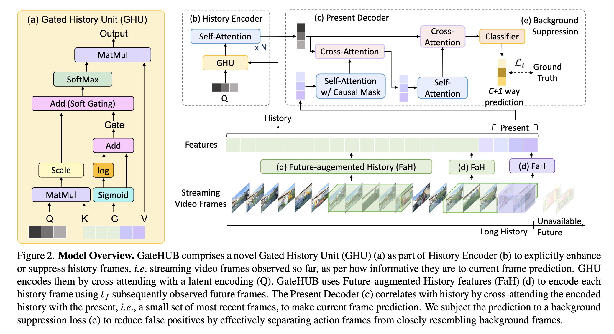
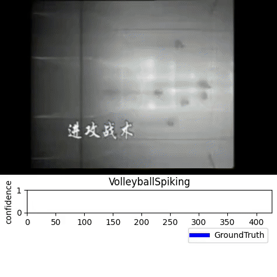

# GateHUB: Gated History Unit with Background Suppression for Online Action Detection | CVPR 2022

[Junwen Chen](https://junwenchen.github.io/)<sup>1,2*</sup>,
[Gaurav Mittal](https://g1910.github.io/)<sup>1*</sup>,
[Ye Yu](https://scholar.google.com/citations?hl=en&user=x4IFIuYAAAAJ&view_op=list_works&sortby=pubdate)<sup>1</sup>,
[Yu Kong](https://www.egr.msu.edu/~yukong/)<sup>2</sup>,
[Mei Chen](https://scholar.google.com/citations?user=DjfReA4AAAAJ&hl=en)<sup>1</sup>

<sup>1</sup>Microsoft &nbsp;&nbsp; <sup>2</sup>Rochester Institute of Technology &nbsp;&nbsp; <sup>*</sup>equal contribution (at the time of acceptance)

[[`Paper`](https://arxiv.org/abs/2206.04668)] [[`arXiv`](https://arxiv.org/abs/2206.04668)] [[`BibTeX`](#citation)]

<p align="center">
  
</p>

**Online action detection** predicts the action in a streaming video *as it happens*, using only
the frames observed so far. The model never sees the future, so everything hinges on how well it
can exploit the past.

The catch is that not all of the past is worth remembering. A video of a cliff dive contains the
dive, but also the crowd cheering and the camera panning — frames that tell you nothing about what
is happening right now. Vanilla cross-attention has no mechanism to tell these apart: its attention
weights simply do not correlate with how informative a history frame actually is.

**GateHUB** fixes this with three ideas:

- **Gated History Unit (GHU)** — a position-guided gated cross-attention that learns a gating score
  per history frame and folds it directly into the attention logits, rescaling each frame's
  contribution by a factor in $[0, e]$. Informative frames get enhanced, uninformative ones get
  suppressed.
- **Future-augmented History (FaH)** — the future of the *current* frame is unavailable, but the
  future of a *history* frame is not. FaH re-encodes older history frames using the frames that were
  subsequently observed, at no extra time complexity.
- **Background suppression objective** — a focal-style loss that applies separate exponents to
  action and background frames, targeting the false positives caused by background frames that
  closely resemble actions (the pre-shot routine before a golf swing).

GateHUB outperforms all prior work on THUMOS'14, TVSeries and HDD while using **fewer parameters
and fewer GFLOPs** than the previous best method. Its optical-flow-free variant runs **2.8× faster**
than methods requiring both RGB and flow, at higher or comparable accuracy.

<p align="center">
  
  <br>
  <em>GateHUB predicting the action for each incoming frame of a streaming video.</em>
</p>

## Status

This repository is being released in stages. Phase 1 is live.

**Available now**
- [x] GateHUB model — Gated History Unit, History Encoder, Present Decoder
- [x] Background suppression objective
- [x] Future-augmented History
- [x] THUMOS'14 training and evaluation
- [x] Per-frame annotations and dataset splits
- [x] Reference configs reproducing the paper settings
- [x] Loader compatibility with checkpoints from the original research code

**Coming soon**
- [ ] Pre-extracted features with a download script
- [ ] Pretrained checkpoints
- [ ] Feature extraction pipeline (TSN, I3D, TimeSformer, FaH windows)
- [ ] TVSeries and HDD
- [ ] Online action anticipation
- [ ] Optical-flow-free variant
- [ ] Gating score visualisations (Fig. 3 and Fig. 4)

## Installation

The code requires `python>=3.8` and `pytorch>=1.6`. Follow the
[official instructions](https://pytorch.org/get-started/locally/) to install PyTorch with CUDA
support, then:

```bash
git clone https://github.com/g1910/GateHUB.git
cd GateHUB
pip install -r requirements.txt
```

## Getting Started

Per-frame annotations and the train/test splits ship with the repository. Extracted features are
downloaded separately — see [Data](#data).

Train on THUMOS'14 with TSN RGB + optical flow features:

```bash
bash configs/thumos_tsn.sh /path/to/features
```

Train with TimeSformer RGB features and Future-augmented History:

```bash
bash configs/thumos_timesformer_fah.sh /path/to/features
```

Evaluate a checkpoint:

```bash
python main.py --eval --resume logs/thumos_tsn/checkpoint.pth \
  --data_root /path/to/features
```

Per-frame mAP over the 20 action classes is printed each epoch and appended to
`<output_dir>/log_train_test.txt`.

## Results

### THUMOS'14

| Method | RGB backbone | Flow backbone | mAP (%) |
| :--- | :---: | :---: | :---: |
| TRN | TSN | TSN | 62.1 |
| OadTR | TSN | TSN | 65.2 |
| WOAD | TSN | TSN | 67.1 |
| LSTR | TSN | TSN | 69.5 |
| **GateHUB** | TSN | TSN | **70.7** |
| LSTR | TimeSformer | TSN | 69.6 |
| **GateHUB** | TimeSformer | TSN | **72.5** |

GateHUB is the first method to pass 70% on THUMOS'14.

### TVSeries and HDD

| Method | TVSeries mcAP (%) | | Method | HDD mAP (%) |
| :--- | :---: | :---: | :--- | :---: |
| OadTR | 87.2 | | OadTR | 29.8 |
| LSTR | 89.1 | | TRN | 29.2 |
| **GateHUB** | **89.6** | | **GateHUB** | **32.1** |

### Efficiency

| Method | Params | GFLOPs | Overall FPS | mAP (%) |
| :--- | :---: | :---: | :---: | :---: |
| TRN | 402.9M | 1.46 | 8.1 | 62.1 |
| OadTR | 75.8M | 2.54 | 8.1 | 65.2 |
| LSTR | 58.0M | 7.53 | 8.1 | 69.5 |
| LSTR (flow-free) | 54.2M | 6.33 | 22.7 | 63.5 |
| **GateHUB** | **45.2M** | 6.98 | 8.1 | **70.7** |
| **GateHUB (flow-free)** | **41.8M** | 3.47 | **22.7** | **66.5** |

All flow-based methods are bottlenecked by optical flow computation at 8.1 FPS.

## Data

Download [THUMOS'14](https://www.crcv.ucf.edu/THUMOS14/download.html). TVSeries and HDD require
signing a usage agreement with their respective authors.

Features are expected in a single directory:

| File | Contents |
| :--- | :--- |
| `thumos_all_feature_{val,test}_tsn_v2.pickle` | `{session: {'rgb': (T, 2048), 'flow': (T, 2048)}}` at 4 FPS |
| `thumos_timesformer_k600_96_1s_temp_end.pkl` | TimeSformer features from the 1 s past window |
| `thumos_timesformer_k600_96_2s_cls.pkl` | TimeSformer features from the 2 s observed future window (FaH) |

A download script is coming as part of the next release.

## Model

GateHUB encodes the observed history into a fixed-size latent through gated cross-attention, then
correlates that latent with the present to classify the current frame.

The gating scores are computed from history features that already carry their position encoding
relative to the current frame, so the gate is both *content*- and *position*-dependent:

$$\mathbf{z^g} = \sigma(\mathbf{z^h}\mathbf{W}^g), \qquad G = \log(\mathbf{z^g}) + \mathbf{z^g}$$

and are folded straight into the attention logits:

$$GHU_i = \mathrm{Softmax}\left(\frac{Q_iK_i^\top}{\sqrt{d_k}} + G\right)V_i$$

Because $\mathbf{z^g} \in [0, 1]$, the softmax rescales each history frame by a factor in $[0, e]$ —
below 1 suppresses, above 1 enhances.

| Component | Paper | Code |
| :--- | :---: | :--- |
| Gating scores | Eqn. 1–2 | [`GateHUB.forward`](gatehub/models/gatehub.py) |
| Gated cross-attention | Eqn. 3–4 | [`GatedAttention`](gatehub/models/attention.py) |
| History Encoder | Fig. 2b | [`HistoryEncoder`](gatehub/models/blocks.py) |
| Present Decoder | Fig. 2c | [`PresentDecoder`](gatehub/models/blocks.py) |
| Future-augmented History | Eqn. 5 | [`THUMOSDataLayer`](gatehub/dataset.py) |
| Background suppression | Eqn. 6 | [`GateHUBCriterion`](gatehub/criterion.py) |

## Citation

If you find GateHUB useful in your research, please cite:

```bibtex
@inproceedings{chen2022gatehub,
  title     = {GateHUB: Gated History Unit with Background Suppression for Online Action Detection},
  author    = {Chen, Junwen and Mittal, Gaurav and Yu, Ye and Kong, Yu and Chen, Mei},
  booktitle = {Proceedings of the IEEE/CVF Conference on Computer Vision and Pattern Recognition (CVPR)},
  year      = {2022}
}
```

## License

This project is released under the [MIT License](LICENSE). Third-party attributions are listed in
[NOTICE](NOTICE).

## Acknowledgements

At Rochester Institute of Technology, Junwen Chen and Yu Kong were supported by NSF SaTC award
1949694 and the Army Research Office under grant W911NF-21-1-0236.

TimeSformer features are extracted with
[TimeSformer](https://github.com/facebookresearch/TimeSformer) (CC-BY-NC 4.0), used as an external
dependency.
